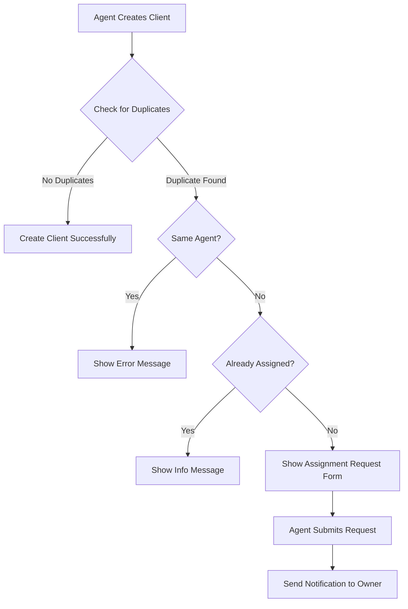
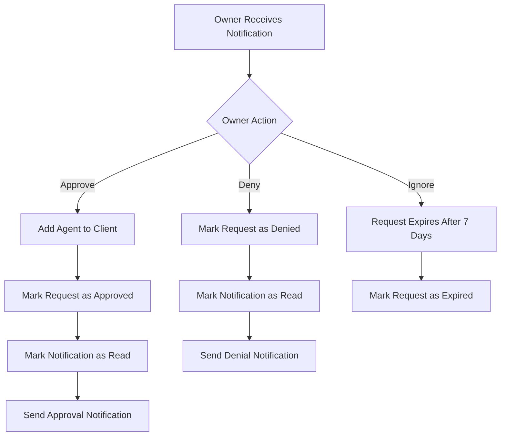

# Client Assignment Request System Documentation

## Overview

The Client Assignment Request System is a comprehensive feature that prevents duplicate client creation while enabling smooth collaboration between agents through an assignment request workflow. When an agent attempts to create a client that already exists, the system redirects them to request assignment from the client's owner instead of allowing duplicates.

## Table of Contents

1. [System Architecture](#system-architecture)
2. [Database Schema](#database-schema)
3. [Key Components](#key-components)
4. [Workflow Process](#workflow-process)
5. [API Endpoints](#api-endpoints)
6. [Configuration](#configuration)
7. [Security Features](#security-features)
8. [User Interface](#user-interface)
9. [Troubleshooting](#troubleshooting)

## System Architecture

### Core Components

```
┌─────────────────┐    ┌──────────────────┐    ┌─────────────────┐
│   Client Form   │───▶│ Duplicate Check  │───▶│ Assignment UI   │
└─────────────────┘    └──────────────────┘    └─────────────────┘
                                │                         │
                                ▼                         ▼
                       ┌──────────────────┐    ┌─────────────────┐
                       │ Show Warning     │    │ Send Request    │
                       │ Modal            │    │ Notification    │
                       └──────────────────┘    └─────────────────┘
                                                         │
                                                         ▼
                                               ┌─────────────────┐
                                               │ Owner Agent     │
                                               │ Notification    │
                                               └─────────────────┘
                                                         │
                                               ┌─────────┴─────────┐
                                               ▼                   ▼
                                    ┌─────────────────┐ ┌─────────────────┐
                                    │ Approve Request │ │ Deny Request    │
                                    └─────────────────┘ └─────────────────┘
```

## Database Schema

### 1. `client_assignment_requests` Table

```sql
CREATE TABLE client_assignment_requests (
    id BIGINT UNSIGNED AUTO_INCREMENT PRIMARY KEY,
    request_token VARCHAR(32) UNIQUE NOT NULL,
    owner_agent_id BIGINT UNSIGNED NOT NULL,
    requesting_agent_id BIGINT UNSIGNED NOT NULL,
    client_id BIGINT UNSIGNED NOT NULL,
    reason TEXT NOT NULL,
    status ENUM('pending', 'approved', 'denied', 'expired') DEFAULT 'pending',
    expires_at TIMESTAMP NOT NULL,
    processed_at TIMESTAMP NULL,
    processed_by BIGINT UNSIGNED NULL,
    process_note TEXT NULL,
    created_at TIMESTAMP NULL,
    updated_at TIMESTAMP NULL,
    
    FOREIGN KEY (owner_agent_id) REFERENCES agents(id) ON DELETE CASCADE,
    FOREIGN KEY (requesting_agent_id) REFERENCES agents(id) ON DELETE CASCADE,
    FOREIGN KEY (client_id) REFERENCES clients(id) ON DELETE CASCADE,
    FOREIGN KEY (processed_by) REFERENCES users(id) ON DELETE SET NULL,
    
    INDEX idx_owner_status (owner_agent_id, status),
    INDEX idx_requesting_status (requesting_agent_id, status),
    INDEX idx_client_status (client_id, status),
    INDEX idx_expires_at (expires_at),
    INDEX idx_request_token (request_token)
);
```

### 2. Enhanced `notifications` Table

```sql
ALTER TABLE notifications ADD COLUMN type VARCHAR(255) NULL AFTER message;
ALTER TABLE notifications ADD COLUMN data JSON NULL AFTER type;
```

### 3. Existing `client_agents` Pivot Table

```sql
-- Many-to-many relationship between clients and agents
CREATE TABLE client_agents (
    client_id BIGINT UNSIGNED,
    agent_id BIGINT UNSIGNED,
    created_at TIMESTAMP NULL,
    updated_at TIMESTAMP NULL,
    
    PRIMARY KEY (client_id, agent_id),
    FOREIGN KEY (client_id) REFERENCES clients(id) ON DELETE CASCADE,
    FOREIGN KEY (agent_id) REFERENCES agents(id) ON DELETE CASCADE
);
```

## Key Components

### 1. ClientAssignmentRequest Model

**Location:** `app/Models/ClientAssignmentRequest.php`

```php
class ClientAssignmentRequest extends Model
{
    // Status constants
    const STATUS_PENDING = 'pending';
    const STATUS_APPROVED = 'approved';
    const STATUS_DENIED = 'denied';
    const STATUS_EXPIRED = 'expired';
    
    // Key methods
    public function approve($userId, $note = null)
    public function deny($userId, $note = null)
    public function isPending()
    public function isExpired()
    public static function generateToken()
    public static function markAllExpired()
    
    // Relationships
    public function ownerAgent()
    public function requestingAgent()
    public function client()
    public function processedBy()
    
    // Scopes
    public function scopePending($query)
    public function scopeActive($query)
    public function scopeByToken($query, $token)
}
```

### 2. Enhanced Notification System

**Location:** `app/Models/Notification.php`

```php
class Notification extends Model
{
    protected $fillable = [
        'user_id', 'title', 'message', 'type', 'data', 'status', 'close'
    ];
    
    protected $casts = [
        'data' => 'array',
    ];
    
    // Helper methods for JSON token search
    public static function findByUserAndToken($userId, $type, $token)
    public function scopeByRequestToken($query, $token)
}
```

### 3. ClientController Enhancements

**Location:** `app/Http/Controllers/ClientController.php`

Key methods added:
- `handleDuplicateClient()` - Detects and handles duplicate clients
- `showAssignmentRequestForm()` - Shows assignment request UI
- `requestAssignment()` - Processes assignment requests
- `sendAssignmentRequest()` - Sends notifications to owner agents
- `approveAssignment()` - Approves assignment requests
- `denyAssignment()` - Denies assignment requests

### 4. Livewire Notification Component

**Location:** `app/Livewire/Notification.php`

Enhanced to display actionable notifications with approve/deny buttons for assignment requests.

## Workflow Process

### 1. Duplicate Detection Flow



### 2. Assignment Request Processing



### 3. Duplicate Detection Logic

The system checks for duplicates using two methods:

1. **Civil Number Match:**
   ```php
   $existingClient = Client::where('company_id', $companyId)
       ->where('civil_no', $civilNo)
       ->first();
   ```

2. **Name + Phone Match:**
   ```php
   $existingClient = Client::where('company_id', $companyId)
       ->where('first_name', $firstName)
       ->where('phone', $cleanPhone)
       ->first();
   ```

## API Endpoints

### Assignment Request Routes

```php
// Located in routes/web.php under 'clients' group

// Submit assignment request
POST /clients/request-assignment
// Controller: ClientController@requestAssignment

// Approve assignment request  
GET /clients/assignment/approve/{token}
// Controller: ClientController@approveAssignment

// Deny assignment request
GET /clients/assignment/deny/{token}  
// Controller: ClientController@denyAssignment
```

### Request Parameters

**POST /clients/request-assignment**
```php
{
    "existing_client_id": "required|exists:clients,id",
    "owner_agent_id": "required|exists:agents,id", 
    "request_reason": "required|string|min:5|max:500"
}
```

## Configuration

### Environment Variables

No additional environment variables required. The system uses existing Laravel configuration.

### Default Settings

- **Request Expiration:** 7 days
- **Token Length:** 32 characters
- **Notification Type:** `client_assignment_request`
- **Assignment Statuses:** `pending`, `approved`, `denied`, `expired`

### Customizable Settings

You can modify these in the `ClientAssignmentRequest` model:

```php
// Change expiration period
'expires_at' => now()->addDays(14), // Change from 7 to 14 days

// Modify token generation
public static function generateToken()
{
    return \Illuminate\Support\Str::random(64); // Increase token length
}
```

## Security Features

### 1. Secure Token System

- **Unique Tokens:** Each request generates a cryptographically secure 32-character token
- **Single Use:** Tokens are tied to specific requests and cannot be reused
- **Expiration:** All tokens expire after 7 days automatically
- **Collision Prevention:** Token uniqueness is enforced at database level

### 2. Authorization Checks

```php
// Only owner agents can approve/deny requests
if (Auth::id() !== $ownerAgent->user_id) {
    return redirect()->route('dashboard')
        ->with('error', 'You are not authorized to approve this request.');
}
```

### 3. Request Validation

- **Active Request Check:** Only pending, non-expired requests can be processed
- **Duplicate Prevention:** Prevents multiple requests for same client-agent combination
- **Input Sanitization:** All user inputs are validated and sanitized

### 4. Audit Trail

Complete logging of all actions:
```php
Log::info('Assignment request approved', [
    'token' => $token,
    'client_id' => $client->id,
    'owner_agent_id' => $ownerAgent->id,
    'requesting_agent_id' => $requestingAgent->id,
    'approved_by' => Auth::id()
]);
```

## User Interface

### 1. Duplicate Warning Modal

**Location:** `resources/views/components/duplicate-client-warning.blade.php`

**Features:**
- Professional design with subtle overlay (30% opacity gray background)
- Client details display
- Assignment request form
- Responsive design
- Alpine.js powered interactions

**Usage:**
```php
@include('components.duplicate-client-warning')
```

### 2. Actionable Notifications

**Location:** `resources/views/livewire/notification.blade.php`

**Features:**
- Dynamic action buttons (Approve/Deny) for pending requests
- Status indicators for processed requests
- Client details in notifications
- Real-time updates via Livewire
- Professional styling without emojis

### 3. Client Profile Page

**Location:** `resources/views/clients/new-profile.blade.php`

**Features:**
- Agent management interface
- Searchable dropdown for agents
- Add/remove agent functionality
- Two-column responsive layout
- Real-time agent filtering

## Troubleshooting

### Common Issues

#### 1. JSON Token Search Not Working

**Problem:** `whereJsonContains` returns null
**Solution:** Use the custom `findByUserAndToken` method instead:

```php
// Instead of this:
$notification = Notification::whereJsonContains('data->request_token', $token)->first();

// Use this:
$notification = Notification::findByUserAndToken($userId, 'client_assignment_request', $token);
```

#### 2. Notification Buttons Not Disappearing

**Problem:** Action buttons still show after approval/denial
**Solution:** Ensure the Livewire component is checking request status:

```php
@if($requestToken && $this->isAssignmentRequestPending($requestToken))
    <!-- Show action buttons -->
@else
    <!-- Show status badge -->
@endif
```

#### 3. Expired Requests Not Cleaning Up

**Problem:** Old requests remain in pending status
**Solution:** The system automatically marks expired requests. You can also run:

```php
ClientAssignmentRequest::markAllExpired();
```

#### 4. Modal Overlay Too Dark

**Problem:** Background overlay is too opaque
**Solution:** Adjust opacity in the modal component:

```php
<div class="fixed inset-0 z-50 flex items-center justify-center bg-gray-900 bg-opacity-30">
```

### Debug Commands

```bash
# Check for pending requests
php artisan tinker
>>> App\Models\ClientAssignmentRequest::pending()->count()

# Check notifications
>>> App\Models\Notification::where('type', 'client_assignment_request')->count()

# Mark expired requests manually
>>> App\Models\ClientAssignmentRequest::markAllExpired()

# Test notification search
>>> App\Models\Notification::findByUserAndToken(1, 'client_assignment_request', 'token_here')
```

### Performance Considerations

1. **Database Indexes:** All critical columns are indexed for optimal performance
2. **Eager Loading:** Relationships are properly eager loaded to prevent N+1 queries
3. **Caching:** Consider caching frequently accessed data like agent lists
4. **Cleanup Job:** Implement a scheduled job to clean up old expired requests

### Migration Commands

```bash
# Run the migrations
php artisan migrate

# Rollback if needed
php artisan migrate:rollback --step=3
```

## Best Practices

### 1. Code Organization
- Keep business logic in models
- Use Eloquent relationships instead of raw queries
- Follow Laravel naming conventions
- Use constants for status values

### 2. Security
- Always validate user permissions
- Use secure token generation
- Implement proper expiration mechanisms
- Log all sensitive actions

### 3. User Experience
- Provide clear error messages
- Use progressive disclosure for complex workflows
- Implement real-time updates where appropriate
- Maintain consistent UI patterns

### 4. Testing
- Write unit tests for model methods
- Test the complete assignment workflow
- Verify security and authorization
- Test edge cases and error conditions

## Future Enhancements

### Potential Improvements

1. **Email Notifications:** Send email alerts for assignment requests
2. **Bulk Assignment:** Allow assigning multiple clients at once
3. **Request Comments:** Add comment system for request discussions
4. **Assignment History:** Track complete assignment history per client
5. **Request Templates:** Pre-defined reason templates for common scenarios
6. **Mobile Optimization:** Enhanced mobile experience
7. **Real-time Notifications:** WebSocket-based instant notifications
8. **Assignment Analytics:** Reports on assignment patterns and metrics

### Implementation Roadmap

1. **Phase 1:** Email notifications and bulk assignment
2. **Phase 2:** Advanced analytics and reporting
3. **Phase 3:** Real-time features and mobile optimization
4. **Phase 4:** AI-powered assignment suggestions

---

## Conclusion

The Client Assignment Request System provides a robust, secure, and user-friendly solution for managing client assignments while preventing duplicate creation. The system follows Laravel best practices, implements comprehensive security measures, and provides an intuitive user experience.

For support or feature requests, please refer to the development team or create an issue in the project repository.

**Last Updated:** September 3, 2025  
**Version:** 1.0.0  
**Status:** Production Ready
