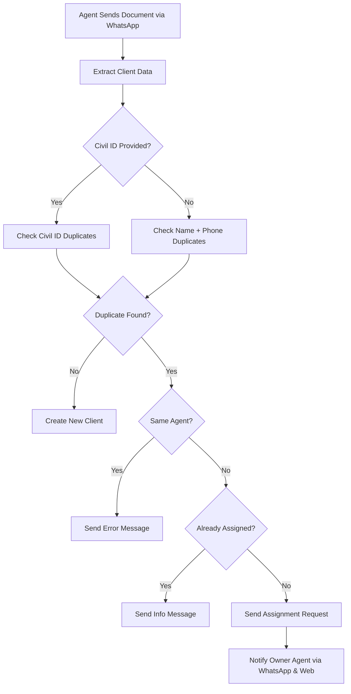
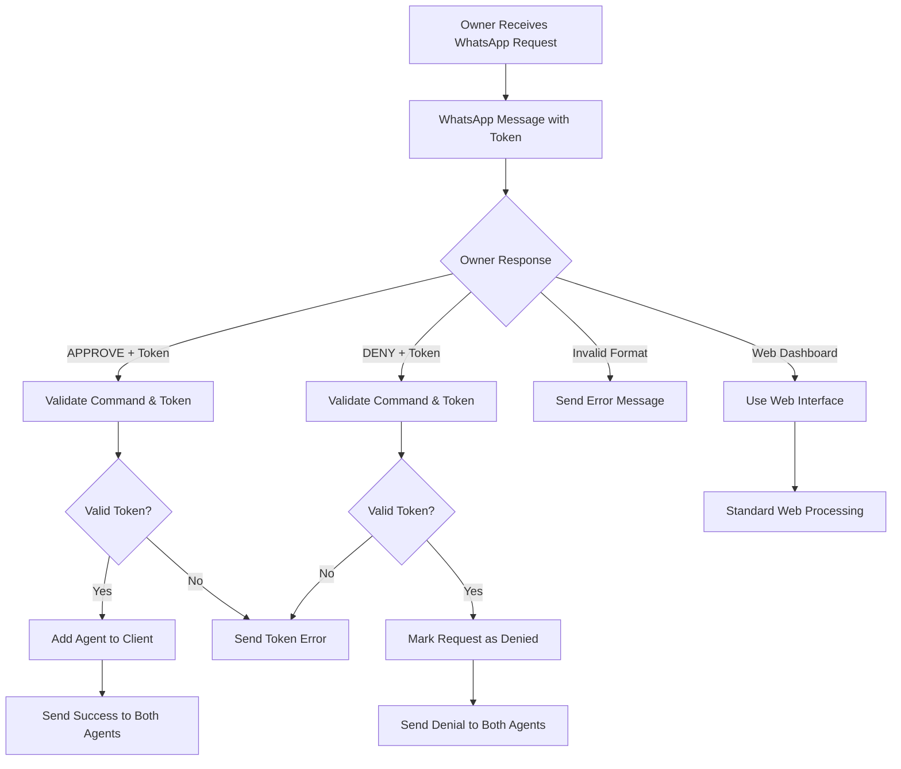

# WhatsApp Client Assignment Request Integration

## Overview

The IncomingMediaController has been successfully updated to integrate with the Client Assignment Request system. This ensures that when agents create clients through WhatsApp messages, the same duplicate prevention and assignment workflow is applied as in the web interface.

## Changes Made

### 1. Added Required Imports

```php
use App\Models\ClientAssignmentRequest;
use App\Models\Notification;
use App\Http\Traits\NotificationTrait;
```

### 2. Added NotificationTrait

```php
class IncomingMediaController extends Controller
{
    use NotificationTrait;
}
```

### 3. Replaced Client Creation Logic

**Previous Behavior:**
- Simple check: `Client::where('civil_no', $data['civil_no'])->first()`
- If client exists → update with new data
- If not exists → create new client
- No duplicate prevention or assignment workflow

**New Behavior:**
- **Company-scoped duplicate detection** using the same logic as ClientController
- **Two-level duplicate checking:**
  1. Civil Number match within company
  2. Name + Phone match within company
- **Assignment request workflow** for cross-agent duplicates
- **WhatsApp-specific messaging** for all scenarios

## Workflow Integration

### 1. Duplicate Detection Process



### 2. WhatsApp Assignment Command Processing



### 2. WhatsApp Response Messages

#### Same Agent Duplicate
```
You already have a client with Civil ID: 12345678901
```

#### Already Assigned
```
You are already assigned to this client: John Doe
You can find them in your client list.
```

#### Assignment Request Sent
```
A client with Civil ID '12345678901' already exists

Client: John Doe
Current Owner: Agent Smith

An assignment request has been sent to Agent Smith for approval.
They will be notified and can approve or deny your request to work with this client.

You will be notified once they respond.
```

#### Owner Agent Assignment Request Notification
```
ASSIGNMENT REQUEST

Agent John Doe is requesting access to your client:
Client: Jane Smith
Civil ID: 12345678901

To respond, reply with one of these commands:
• APPROVE ABC123DEF456GHI789JKL012MNO345
• DENY ABC123DEF456GHI789JKL012MNO345

Or you can approve/deny from the web dashboard.
```

#### Assignment Approval Responses
```
REQUEST APPROVED

You have successfully approved the assignment request.
Agent John Doe now has access to client: Jane Smith
```

```
ASSIGNMENT APPROVED

Your request to access client Jane Smith has been approved by Agent Smith.
You can now find this client in your client list.
```

#### Assignment Denial Responses
```
REQUEST DENIED

You have denied the assignment request.
Agent John Doe will be notified of your decision.
```

```
ASSIGNMENT DENIED

Your request to access client Jane Smith has been denied by Agent Smith.
Please contact Agent Smith directly if you need to discuss this decision.
```

#### Successful Creation
```
Thank you, your client's profile has been created successfully.

Client: John Doe
Civil ID: 12345678901
```

## Technical Implementation

### 1. Duplicate Detection Logic

```php
// Check for duplicate clients using the same logic as ClientController
$currentAgent = Agent::find($agentId);
$companyId = $currentAgent->branch->company_id ?? null;
$existingClient = null;
$duplicateType = null;

// First check: Civil Number duplicate (if provided)
if (!empty($data['civil_no'])) {
    $existingClient = Client::where('civil_no', $data['civil_no'])
        ->whereHas('agent.branch', function ($q) use ($companyId) {
            $q->where('company_id', $companyId);
        })
        ->first();
    
    if ($existingClient) {
        $duplicateType = 'civil_no';
    }
}

// Second check: Name + Phone duplicate (if civil check didn't find anything)
if (!$existingClient && !empty($data['first_name']) && !empty($localNumberClient)) {
    $existingClient = Client::where('first_name', $data['first_name'])
        ->where('phone', $localNumberClient)
        ->whereHas('agent.branch', function ($q) use ($companyId) {
            $q->where('company_id', $companyId);
        })
        ->first();
    
    if ($existingClient) {
        $duplicateType = 'name_phone';
    }
}
```

### 2. WhatsApp Command Detection and Processing

```php
// Command detection in webhook processing
private function isAssignmentCommand($message)
{
    $message = strtoupper(trim($message));
    return preg_match('/^(APPROVE|DENY)\s+[A-Z0-9]{32}$/i', $message);
}

// Command processing with validation
private function handleAssignmentCommand($message, $agent, $request)
{
    $parts = explode(' ', strtoupper(trim($message)));
    $command = $parts[0]; // APPROVE or DENY
    $token = $parts[1];   // 32-character token

    // Find and validate assignment request
    $assignmentRequest = ClientAssignmentRequest::where('request_token', $token)
        ->where('owner_agent_id', $agent->id)
        ->where('status', ClientAssignmentRequest::STATUS_PENDING)
        ->first();

    // Process approval or denial with transaction safety
    DB::beginTransaction();
    try {
        if ($command === 'APPROVE') {
            $client->agents()->syncWithoutDetaching([$requestingAgent->id]);
            $assignmentRequest->approve($agent->user_id, 'Approved via WhatsApp');
        } elseif ($command === 'DENY') {
            $assignmentRequest->deny($agent->user_id, 'Denied via WhatsApp');
        }
        
        // Send confirmations to both agents
        $this->sendWhatsAppMessage($ownerAgent->phone_number, $confirmationMessage);
        $this->sendWhatsAppMessage($requestingAgent->phone_number, $notificationMessage);
        
        DB::commit();
    } catch (Exception $e) {
        DB::rollBack();
        // Handle error
    }
}
```

### 3. Assignment Request Creation

```php
private function handleWhatsAppAssignmentRequest($existingClient, $currentAgent, $ownerAgent, $duplicateType, $data)
{
    // Create assignment request with WhatsApp context
    $assignmentRequest = ClientAssignmentRequest::create([
        'request_token' => ClientAssignmentRequest::generateToken(),
        'owner_agent_id' => $ownerAgent->id,
        'requesting_agent_id' => $currentAgent->id,
        'client_id' => $existingClient->id,
        'reason' => "WhatsApp client creation request - Agent {$currentAgent->name} attempted to create a client profile via WhatsApp for: {$data['first_name']} {$data['last_name']}",
        'status' => ClientAssignmentRequest::STATUS_PENDING,
        'expires_at' => now()->addDays(7),
    ]);

    // Send notification to owner agent
    $notificationData = [
        'request_token' => $assignmentRequest->request_token,
        'client_id' => $existingClient->id,
        'client_name' => "{$existingClient->first_name} {$existingClient->last_name}",
        'requesting_agent_name' => $currentAgent->name,
        'duplicate_type' => $duplicateType,
        'source' => 'whatsapp'
    ];

    $this->storeNotification([
        'user_id' => $ownerAgent->user_id,
        'title' => "Assignment Request via WhatsApp",
        'message' => "Agent {$currentAgent->name} is requesting access to your client through WhatsApp.",
        'type' => 'client_assignment_request',
        'data' => $notificationData
    ]);
}
```

## Key Features

### ✅ **Complete Integration**
- Same duplicate detection logic as web interface
- Company-scoped duplicate checking
- Assignment request workflow for cross-agent scenarios

### ✅ **WhatsApp-Specific Features**
- Context-aware professional messaging for WhatsApp
- Automatic assignment request creation from WhatsApp
- WhatsApp source tracking in notifications

### ✅ **WhatsApp Command Processing**
- Owner agents can approve/deny directly from WhatsApp
- Secure token-based command system
- Automatic confirmation messages to both agents
- Fallback to web dashboard if preferred

### ✅ **Data Consistency**
- IncomingMedia record still created and linked to client
- Transaction-based operations ensure data integrity
- Cache cleanup after processing

### ✅ **Notification System**
- Owner agents receive notifications for WhatsApp requests
- Same approval/denial workflow as web requests
- WhatsApp source identification in notification data

## Testing Scenarios

### 1. New Client Creation
- Agent sends client document via WhatsApp
- No duplicates found
- Client created successfully
- Success message sent via WhatsApp

### 2. Same Agent Duplicate
- Agent sends document for client they already have
- Error message sent via WhatsApp
- No new records created

### 3. Already Assigned Client
- Agent sends document for client they're already assigned to
- Info message sent via WhatsApp
- Media record linked to existing client

### 4. Cross-Agent Duplicate
- Agent sends document for client owned by another agent
- Assignment request created automatically
- Notification sent to owner agent
- Requesting agent informed about pending request
- Owner can approve/deny through web interface OR WhatsApp commands

### 5. WhatsApp Command Approval
- Owner agent receives WhatsApp message with APPROVE/DENY commands
- Owner agent copies and sends: `APPROVE ABC123DEF456...`
- System processes approval automatically
- Both agents receive confirmation messages
- Client assignment updated in database

### 6. WhatsApp Command Denial
- Owner agent receives WhatsApp message with commands
- Owner agent sends: `DENY ABC123DEF456...`
- System processes denial automatically
- Both agents receive notification messages
- Request marked as denied in database

### 7. Invalid WhatsApp Commands
- Owner agent sends malformed command: `APPROVE` (missing token)
- System responds with format error message
- Original request remains pending
- Agent can retry with correct format or use web dashboard

### 8. Expired Token Handling
- Owner agent tries to use expired token
- System responds with expiration error message
- Agent directed to use web dashboard for further actions

## Response Flow Examples

### Scenario 1: Civil ID Duplicate (Different Agent)
1. Agent B sends Civil ID document via WhatsApp
2. System detects Civil ID already exists (owned by Agent A)
3. WhatsApp response: "A client with Civil ID 'XXX' already exists..."
4. Assignment request created with token
5. Notification sent to Agent A
6. Agent A can approve/deny via web dashboard

### Scenario 3: Complete WhatsApp Assignment Workflow
1. Agent B sends Civil ID document via WhatsApp
2. System detects duplicate (owned by Agent A)
3. WhatsApp response to Agent B: "Assignment request sent..."
4. Agent A receives WhatsApp with commands: "ASSIGNMENT REQUEST... • APPROVE ABC123..."
5. Agent A replies: `APPROVE ABC123DEF456GHI789JKL012MNO345`
6. System processes approval
7. Agent A gets: "REQUEST APPROVED - You approved Agent B's access..."
8. Agent B gets: "ASSIGNMENT APPROVED - Your request was approved..."
9. Agent B can now access the client

### Scenario 4: WhatsApp Command Error Handling
1. Agent A receives assignment request with token
2. Agent A replies: `APPROVE` (missing token)
3. System responds: "Invalid command format. Use: APPROVE [TOKEN] or DENY [TOKEN]"
4. Agent A corrects: `APPROVE ABC123DEF456GHI789JKL012MNO345`
5. System processes successfully

## Compatibility

### ✅ **Backward Compatible**
- Existing WhatsApp workflow unchanged for valid new clients
- All existing IncomingMedia processing maintained
- No breaking changes to current functionality

### ✅ **Web Integration**
- Assignment requests from WhatsApp appear in web dashboard
- Same approval workflow as web-based requests
- Notifications system fully integrated

### ✅ **Database Consistency**
- Uses existing ClientAssignmentRequest model
- Leverages existing notification system
- Maintains referential integrity

## Configuration

No additional configuration required. The integration uses:
- Existing `client_assignment_requests` table
- Existing notification system
- Existing agent and client relationships
- Current WhatsApp webhook processing

## Monitoring and Logging

Enhanced logging for debugging:
```php
Log::info("WhatsApp assignment request created", [
    'request_token' => $assignmentRequest->request_token,
    'owner_agent' => $ownerAgent->name,
    'requesting_agent' => $currentAgent->name,
    'client_id' => $existingClient->id,
    'duplicate_type' => $duplicateType
]);
```

## Next Steps

1. **Test the integration** with real WhatsApp scenarios
2. **Monitor assignment request patterns** from WhatsApp
3. **Consider adding email notifications** for WhatsApp-originated requests
4. **Review agent training** for new WhatsApp workflow

---

**Status:** ✅ Complete and Ready for Testing  
**Last Updated:** September 3, 2025  
**Integration Point:** IncomingMediaController::handleResayilWebhook()
